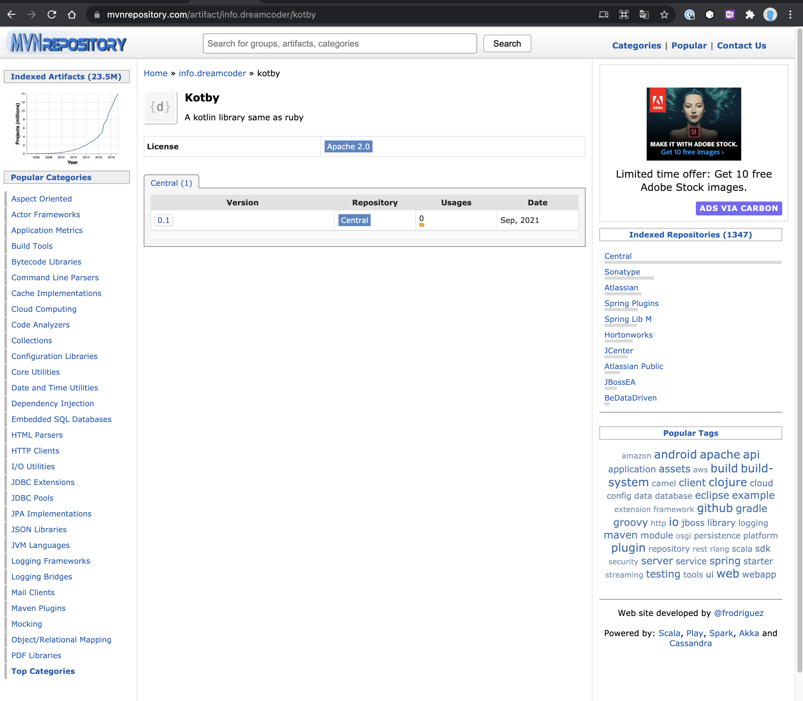
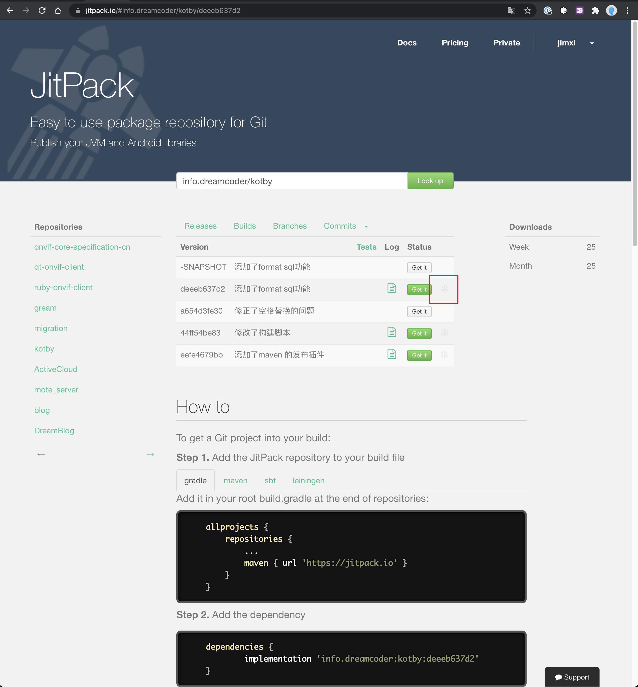

进过一个多星期的处理，第一个maven的代码库上线了。[Kotby](https://mvnrepository.com/artifact/info.dreamcoder/kotby)

主要参考了 [segmentfault](https://segmentfault.com/a/1190000018026290) 以及 [官方文档](https://docs.gradle.org/current/userguide/publishing_maven.html)

这些过程是比较复杂的，其实刚开始编写库的时候完全不需要折腾这么久可以使用 [jitpack](https://jitpack.io/) 来发布，只需要调代码到github上，他就能识别了。只是偶尔有一些小bug。

例如最开始换个版本无论如何就是没办法被新项目使用，但是看日志，各种文件都是正确生成的。最后无意发现截图有个删除的功能，删除后再重新构建竟然就可以了。

